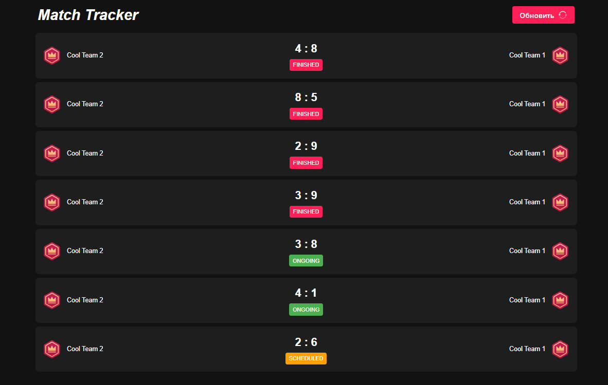
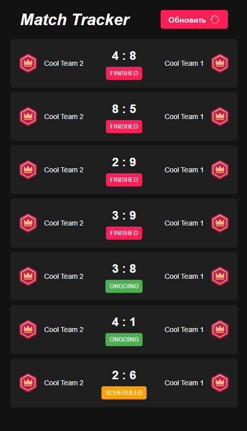

# 🏆 Match Tracker

Современное веб-приложение для отслеживания матчей в реальном времени. Молниеносные обновления и стильный адаптивный интерфейс, который отлично выглядит на любом устройстве.

## ✨ Возможности

- **Обновления в реальном времени**
- **Адаптивный дизайн**
- **Индикаторы статуса**
- **Обработка ошибок**
- **Состояния загрузки**

## 🛠 Технологии

- **React**
- **TypeScript** 
- **CSS Modules**
- **Vite** 

## 🚀 Как запустить

1. Клонируйте репозиторий:

```bash
git clone https://github.com/Petrochenk0/Match-Tracker.git
```

2. Установите зависимости:

```bash
cd match-tracker
npm install
```

3. Запустите сервер разработки:

```bash
npm run dev
```

4. Откройте [http://localhost:5173](http://localhost:5173) в браузере

## 📱 Скриншоты

### Десктопная версия



### Мобильная версия



## 🔧 Интеграция с API

Приложение интегрируется с мощным бэкенд-сервисом, который предоставляет данные о матчах в реальном времени:

- Детали матчей (команды, счет)
- Обновления статусов в реальном времени
- История матчей

---

Сделано с ❤️ Nikita Petrochenko